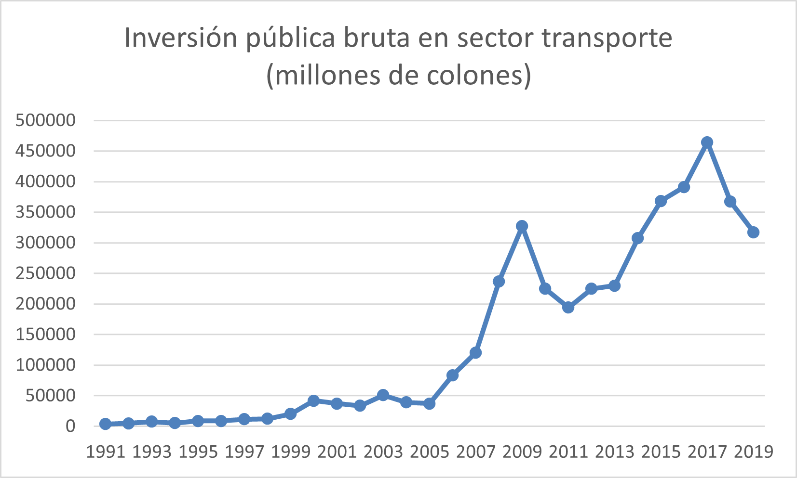
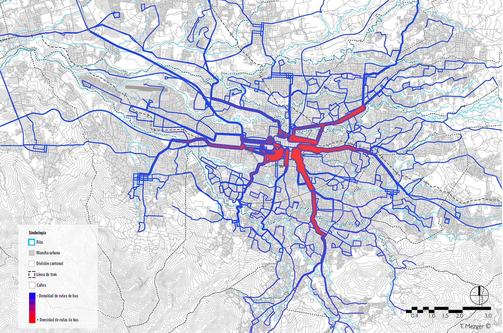

# Geografía, transportes e infraestructura en Costa Rica

## Introducción

Cuando el modelo de desarrollo latinoamericano se tornó neoliberal a partir de la década de 1970, se adoptaron en la región una serie de políticas impulsadas principalmente por el Banco Mundial (BM) y el Fondo Monetario Internacional (FMI), orientadas, entre otras cosas, hacia la liberalización del comercio, las exportaciones y la atracción de inversión extranjera (Perrault y Martin 2005). Una de las acciones clave para crear un ambiente propicio para este tipo de inversión, aumentar el flujo de exportaciones y promover este modelo de desarrollo en general, es la construcción y modernización de infraestructura de transporte ya que toda actividad económica requiere de condiciones infraestructurales  para la circulación. Ante la importancia 

## Inversión pública bruta en el sector transporte (millones de colones)
Entre 1991 y 2019, la inversión pública bruta en el sector transporte en Costa Rica ha experimentado fluctuaciones significativas, reflejando las prioridades y desafíos económicos del país a lo largo de casi tres décadas. Durante este período, se han destinado importantes sumas en millones de colones para modernizar y expandir la infraestructura vial, ferroviaria y de transporte público, buscando mejorar la conectividad y la eficiencia del sistema. No obstante, la inversión ha mostrado variaciones anuales, influenciadas por factores como las políticas gubernamentales, las condiciones económicas y las necesidades emergentes del sector. Este enfoque en el transporte es crucial para apoyar el desarrollo económico y social del país.

*Elaboración propia a partir del [Programa Estado de la Nación (PEN)](https://estadisticas.estadonacion.or.cr/)*

## Retos y desafíos en la movilidad y el transporte en el Gran Área Metropolitana (GAM)
En el GAM de Costa Rica, los principales retos y desafíos para la movilidad y el transporte están estrechamente vinculados al **tipo de crecimiento urbano**, al **uso excesivo del automóvil privado** y a la **falta de un adecuado ordenamiento territorial**. El rápido crecimiento urbano ha llevado a una expansión desordenada, mientras que la dependencia del automóvil privado ha exacerbado la congestión y la contaminación. Además, la ausencia de una planificación territorial efectiva ha dificultado la integración y eficiencia del sistema de transporte público. Estos factores se reflejan claramente en el mapa de densidad de las rutas de buses en el GAM, que ilustra cómo la infraestructura existente lucha por satisfacer las necesidades de una población en constante expansión.

**_Densidad de las rutas de buses en la GAM. 2017_**. Fuente: Mezger, T. 2018. _Densidad en la ruta de buses en la GAM (mapa)_. Contribución especial realizada para el Informe Estado de la Nación 2018. San José: PEN, citado en [La Nación](https://www.nacion.com/gnfactory/especiales/2019/LN_soluciones_Transporte/sectorizacion.html)

## Criterios de evaluación del Laboratorio Nacional de Materiales y Modelos Estructurales (LANAMME)
Los Criterios de Evaluación del LANAMME permiten una evaluación integral de la infraestructura vial.
- Clasificación	geográfica 	diferenciada 	 por tipo de ruta.
- División	entre	los	dos	activos	principales: pavimentos y puentes. 
- Un	criterio	de	condición	 asociado	a	la	 calidad del pavimento (de acuerdo con los datos del Lanamme-UCR).
- Un	 criterio	 de	condición	 asociado	 al	 cumplimiento del número de carriles, tanto para pavimentos como para puentes.
Puentes	diseñados	o	construidos	antes	 de 1977.

###### Referencia bibliográficas
Consejo Nacional de Rectores (Costa Rica). Programa Estado de la Nación. 2018. Estado de la Nación en desarrollo humano sostenible [2018]. San José, C.R. : PEN. https://repositorio.conare.ac.cr/handle/20.500.12337/2983.
